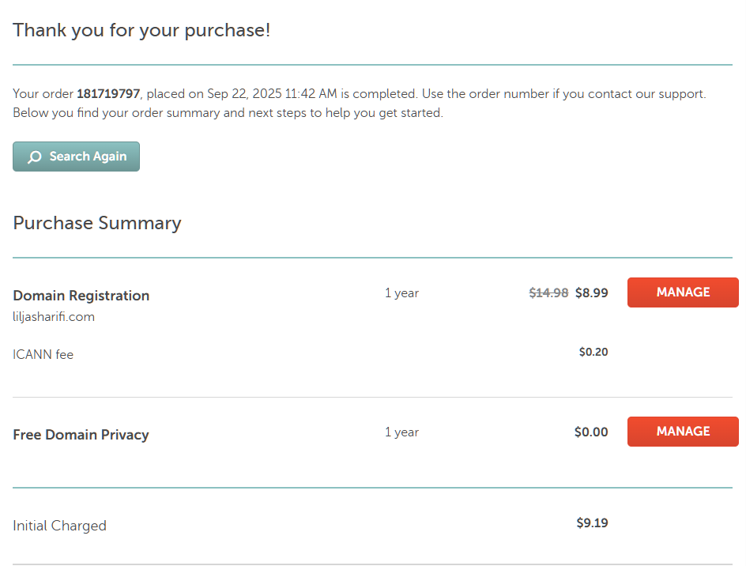
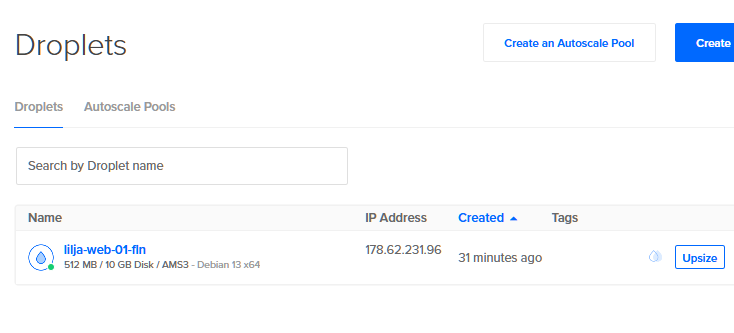
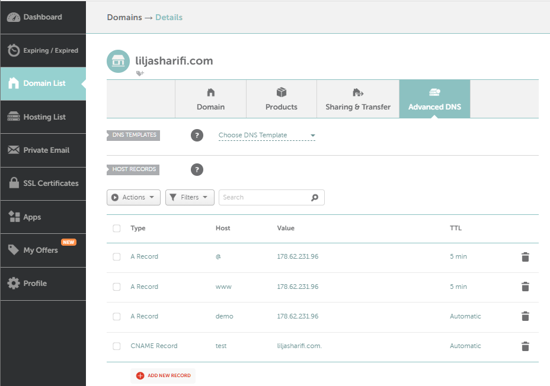
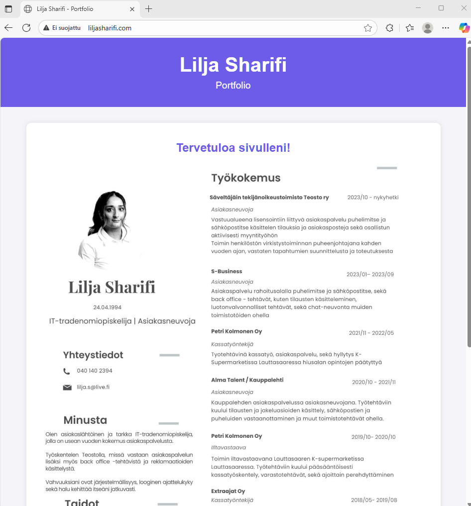

# h5-Nimekäs

[a) Nimi](#a-Nimi)

[b) Alidomain. ](#b-Alidomain.)

[c) Host ja dig](#c-Host-ja-dig)


### Koneen tekniset tiedot
* Prosessori: Intel Core i5-8265U CPU @ 1.60 GHz (1.80 GHz turbo, 8 ydintä)
* RAM: 16 GB (15,7 GB käytettävissä)
* Järjestelmä: Windows 11 Pro 64-bittinen (x64-suoritin)
* Näytönohjain: Intel UHD Graphics 620
* Tallennustila: 237 GB, josta 158 GB vapaana
* DirectX-versio: DirectX 12


# a) Nimi. 

Lähdin tekemään raporttia 23.09.2025 kello 17.00.

Hyödynsin tässä tehtävänosiossa h4 tehtävää, jonka tein aiemmin ja käytin myös Karvisen (2017) ja Digital Oceanin (2016) ohjetta.

Lähdin ensin vuokraamaan nimen liljasharifi.com (päädomain). Sain onneksi alennuskoodilla hieman alennusta ensimmäiseen vuoteen. 
Luotuna oli myös liljasharifi.me jonka sai Github Educationin kautta vuodeksi ilmatteeksi.

Käytin tässä tehtävänannossa liljasharifi.com -domainia. Olin aiemmin luonut Github Educationin kautta saadun liljasharifi.me, mutta haluan hyödyntää jatkossakin domainia, joten .com - päätteisellä lähdin etenemään.



_Onnistunut Domainin vuokraus_



_Aiemmin luotu virtuaalipalvelimeni_ 

* Virtuaalipalvelimen sai kätevästi Digital Oceanilta siten, että Github Educationin krediiteillä (200 dollaria) sai sen ilmatteeksi.

Siirryin UpCloudista DigitalOceanii tätä hyödyntämään. 

### Osoittaminen


_Julkisen nimen osoittamista omaan koneeseen_ 

Etenin seuraavasti NameCheapissa:

* **Domain list** vasemmasta palkista
* **Manage** klikattiin seuraavaksi
* **Advanced DNS** domain -palkin alasvetovalikosta
* **Add a new record**
  - Type: `A record`
  - Host: `@`
  - Value: IP Address eli: `178.62.231.96`
  - TTL: `5 min`

  Toinen vielä eli 
  - Type: `A record`
  - Host: `www`
  - Value: IP Address eli: `178.62.231.96`
  - TTL: `5 min`
 
  Lopuksi vielä tallennus.
 


_Lähti toimimaan_

# b) Alidomain.

Tähän tehtävänosioon siirryin 19.30. Aiempaan tehtävänosioon kului aikaa, sillä jouduin muutaman kerran tekemään dropletin uudelleen.

Tässä käytetty apuna DigitalOceanin (2022) ja Karvisen (2017) ohjetta.

Olin tehnyt niin paljon testisivustoja, että oli paras aloittaa puhtaalta alustalta.

**Tarkistin** ensin käytössä olevat Virtualhostit
* **`ls -l /etc/apache2/sites-available/`**
* **`ls -l /etc/apache2/sites-enabled/`**

**Poistin** 
* **`sudo a2dissite`** - komennolla poistin vanhat sivut ja konfiguraatiotiedostot **(.com.conf)**

NameCheapissa kävin vain osoittamassa domainin uuteen virtuaalipalvelimeni IP-osoitteeseen.

**Alidomainien luominen** tuntui olevan helpoin osuus. 

Kävin tutusta paikasta eli NameCheapista luomassa alidomainit **`test`** ja **`demo`**

1. Domain-listiin
2. Klikkasin manage -painikkeesta
3. Advanced DNS
* Uusi `A Record`
* Host: `Demo`
* Value: `178.62.231.96`

Ja sama toistettiin mutta tällä kertaa:
* Uusi `CNAME Record`
* Host: `test`
* Value: `liljasharifi.com`

Molempiin automaattinen TTL (TimeToLive).


_Alidomainit test ja demo luotu_

**Bonus**

Virtuaalikoneen terminaaliin ja sinne komento:

* **`sudo nano /etc/apache2/sites-available/demo.liljasharifi.com.conf`**
  - Sisällöksi:

```<VirtualHost *:80>
    ServerName liljasharifi.com
    ServerAlias www.liljasharifi.com
    DocumentRoot /var/www/liljasharifi.com

    <Directory /var/www/liljasharifi.com>
        AllowOverride All
        Require all granted
    </Directory>
</VirtualHost>```

Loppuun vielä aktivointi/enablointi:
* **`sudo a2ensite demo.liljasharifi.com.conf`**
* **`sudo systemctl reload apache2`**

Yllä oleva toimenpide toistettiin toiselle alidomainille (test).

Tarkistus vielä loppuun `curl` - komentoa käyttäen.

Kävin tämän tehtäväosion aikana lisäämässä websivustoon CV:ni, jotta se olisi jotenkin järkevämmän oloinen.

Tähän löytyikin muutama hyvä ohje kun tajusi etsiä oikealla hakusanalla. (Gray 2021) videolta ja (W3schools) löytyi tähän kohtaan apua. 

**Pikaohje** 

Kuva pitää olla virtuaalikoneelle asennettuna

* Canva.com virtuaalikoneen internet-selaimeen
* Lataa jpg-tiedostona CV
* Lataa se yksinkertaiseen polkuun (Downloads) ja yksinkertaisella nimellä (cv.jpg)
* Lisätään HTML -tiedoston sisältöön `sudo nano~/Downloads/index.html` - komennolla



_CV lisätty sivustolle_


# c) Host ja dig.


  # Lähteet

Gray, D. 2022. Youtube. Video. _How to Insert Images in HTML | An HTML5 Image Tutorial_ Katsottavissa: https://www.youtube.com/watch?v=0pBAfkZMKy0/ Katsottu: 23.09.2025.

Karvinen, T. 2017. Verkkosivu. _First Steps on a New Virtual Private Server – an Example on DigitalOcean and Ubuntu 16.04 LTS_ Luettavissa: https://terokarvinen.com/2017/first-steps-on-a-new-virtual-private-server-an-example-on-digitalocean/ Luettu: 16.09.2025.

Karvinen, T. 2025. Verkkosivu. _Linux Palvelimet 2025 alkusyksy_ Luettavissa: https://terokarvinen.com/linux-palvelimet/ Luettu: 20.08.2025.

Anicas, M. 2016. DigitalOcean. Artikkeli. _Initial Server Setup with Ubuntu 16.04_ Luettavissa: https://www.digitalocean.com/community/tutorials/initial-server-setup-with-ubuntu-16-04/ Luettu: 22.09.2025.

Yang, K. & Tagliaferri, L. 2022. DigitalOcean. Artikkeli. _How To Set Up Apache Virtual Hosts on Ubuntu 20.04_ Luettavissa: https://www.digitalocean.com/community/tutorials/how-to-set-up-apache-virtual-hosts-on-ubuntu-20-04 Luettu: 23.09.2025.

W3schools. Verkkosivu. _HTML Images_ Luettavissa: https://www.w3schools.com/html/html_images.asp Luettu: 23.09.2025

