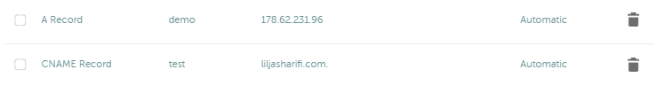
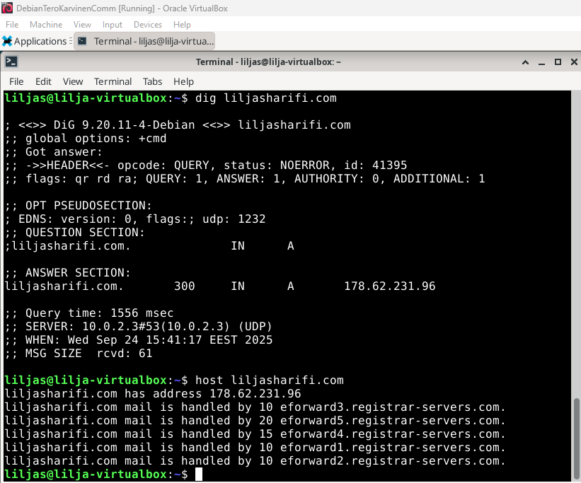
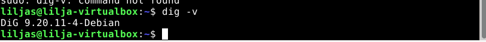
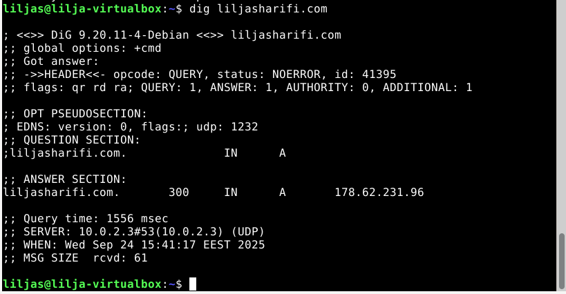
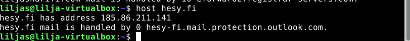
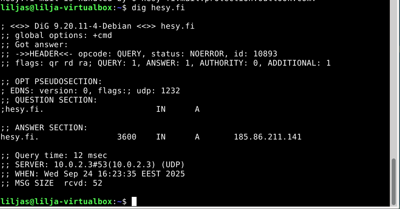
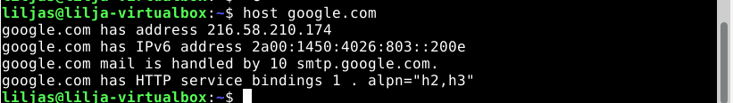
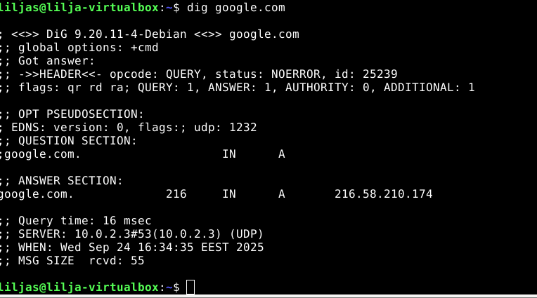

# h5-Nimekäs

[a) Nimi](#a-Nimi)

[b) Alidomain](#b-Alidomain)

[c) Host ja dig](#c-Host-ja-dig)


### Koneen tekniset tiedot
* Prosessori: Intel Core i5-8265U CPU @ 1.60 GHz (1.80 GHz turbo, 8 ydintä)
* RAM: 16 GB (15,7 GB käytettävissä)
* Järjestelmä: Windows 11 Pro 64-bittinen (x64-suoritin)
* Näytönohjain: Intel UHD Graphics 620
* Tallennustila: 237 GB, josta 158 GB vapaana
* DirectX-versio: DirectX 12


# a) Nimi

Lähdin tekemään raporttia 23.09.2025 kello 17.00.

Hyödynsin tässä tehtävänosiossa h4 tehtävää, jonka tein aiemmin ja käytin myös Karvisen (2017) ja Digital Oceanin (2016) ohjetta.

Ensin vuokrasin nimen liljasharifi.com (päädomain). Sain onneksi alennuskoodilla hieman alennusta ensimmäiseen vuoteen. 
Luotuna oli myös liljasharifi.me jonka sai Github Educationin kautta vuodeksi ilmatteeksi.

Käytin tässä tehtävänannossa liljasharifi.com -domainia. Olin aiemmin luonut Github Educationin kautta saadun liljasharifi.me, mutta haluan hyödyntää jatkossakin domainia, joten .com - päätteisellä lähdin etenemään.


_Onnistunut Domainin vuokraus_


_Aiemmin luotu virtuaalipalvelimeni_ 

* Virtuaalipalvelimen sai kätevästi Digital Oceanilta siten, että Github Educationin krediiteillä (200 dollaria) sai sen ilmatteeksi.

Siirryin UpCloudista DigitalOceanii tätä hyödyntämään. 

### Osoittaminen


_Julkisen nimen osoittamista omaan koneeseen_ 

Etenin seuraavasti NameCheapissa:

* **Domain list** vasemmasta palkista
* **Manage** klikattiin seuraavaksi
* **Advanced DNS** domain -palkin alasvetovalikosta
* **Add a new record**
  - Type: `A record`
  - Host: `@`
  - Value: IP Address eli: `178.62.231.96`
  - TTL: `5 min`

  Toinen vielä eli 
  - Type: `A record`
  - Host: `www`
  - Value: IP Address eli: `178.62.231.96`
  - TTL: `5 min`
 
  Lopuksi vielä tallennus.
 


_Lähti toimimaan_

# b) Alidomain

Tähän tehtävänosioon siirryin 19.30. Aiempaan tehtävänosioon kului aikaa, sillä jouduin muutaman kerran tekemään dropletin uudelleen.

Tässä käytetty apuna DigitalOceanin (2022) ja Karvisen (2017) ohjetta.

Olin tehnyt niin paljon testisivustoja, että oli paras aloittaa puhtaalta alustalta.

**Tarkistin** ensin käytössä olevat Virtualhostit
* **`ls -l /etc/apache2/sites-available/`**
* **`ls -l /etc/apache2/sites-enabled/`**

**Poistin** 
* **`sudo a2dissite`** - komennolla poistin vanhat sivut ja konfiguraatiotiedostot **(.com.conf)**

NameCheapissa kävin vain osoittamassa domainin uuteen virtuaalipalvelimeni IP-osoitteeseen.

**Alidomainien luominen** tuntui olevan helpoin osuus. 

Kävin tutusta paikasta eli NameCheapista luomassa alidomainit **`test`** ja **`demo`**

1. Domain-listiin
2. Klikkasin manage -painikkeesta
3. Advanced DNS
* Uusi `A Record`
* Host: `Demo`
* Value: `178.62.231.96`

Ja sama toistettiin mutta tällä kertaa:
* Uusi `CNAME Record`
* Host: `test`
* Value: `liljasharifi.com`

Molempiin automaattinen TTL (TimeToLive).



_Alidomainit test ja demo luotu_

**Bonus**

Virtuaalikoneen terminaaliin ja sinne komento:

* **`sudo nano /etc/apache2/sites-available/demo.liljasharifi.com.conf`**
  - Sisällöksi:

```
<VirtualHost *:80>
    ServerName liljasharifi.com
    ServerAlias www.liljasharifi.com
    DocumentRoot /var/www/liljasharifi.com

    <Directory /var/www/liljasharifi.com>
        AllowOverride All
        Require all granted
    </Directory>
</VirtualHost>
```


Loppuun vielä aktivointi/enablointi:
* **`sudo a2ensite demo.liljasharifi.com.conf`**
* **`sudo systemctl reload apache2`**

Yllä oleva toimenpide toistettiin toiselle alidomainille (test).

Tarkistus vielä loppuun `curl` - komentoa käyttäen.

### Kuvan lisääminen HTML-sivulle

Kävin tämän tehtäväosion aikana lisäämässä websivustoon CV:ni, jotta se olisi jotenkin järkevämmän oloinen.

Tähän löytyikin muutama hyvä ohje kun tajusi etsiä oikealla hakusanalla. (Gray 2021) videolta ja (W3schools) löytyi tähän kohtaan apua. 

**Pikaohje** 

Mikäli haluat kuvan sivustolle, etene seuraavasti:

* Kuva pitää olla virtuaalikoneelle asennettuna
  
* Canva.com virtuaalikoneen internet-selaimeen
  
* Lataa jpg-tiedostona CV
  
* Lataa se yksinkertaiseen polkuun (Downloads) ja yksinkertaisella nimellä (cv.jpg)
  
* Lisätään HTML -tiedoston sisältöön `nano ~/Downloads/index.html` - komennolla

* `` - koodilla kuva esiin


_CV lisätty sivustolle_


# c) Host ja dig

### host -komento
 
Aloitin ensin sillä, että mietin mikä host -komento on ja mitä se tekee.

host on komentorivityökalu, jolla voidaan selvittää **olennaisimmat** tiedot kuten isäntäkoneen IP-osoite nimen perusteella tai käänteisellä haulla selvittää domain-nimi IP-osoitteen avulla. (DNS Lookup). Tässä käytin apuna ClouDNS (2025) ohjetta.


### host liljasharifi.com



_komennon tulos_

* **Näyttää A ja AAAA Recordsin sisällön**   178.62.231.96 A-tietue eli IPv4. AAAA-tietuetta ei ole (IPv6) osoite.

*  **MX-tietueet eli Mail Exchange information - spesifioi mitä sähköpostipalvelimia kyseinen domain käyttää: "mail is handled by.."** => Prioriteetti on 10 eli korkein


### dig -komento

dig -komentorivityökalua käytetään hieman laajempaan viankartoitukseen ja on **tarkempi/perusteellisempi kuin host**. Se tekee myös DNS Lookup kyselyitä, eli voi hakea isäntäkoneen IP-osoitteen nimen perusteella ja käänteisellä haulla domain-nimi taas IP-osoitteen avulla. 

Tähän komentorivityökaluun sisältyy myös tietojen haku DNS-palvelimelta, verkkoyhteysongelmien ja DNS-ongelmien tunnistaminen, sekä vianmääritys.

Lähdin seuraamaan tässä DigitalOceanin ohjeistusta (2024)

1. Asensin ensin varuiksi dig komentorivityökalun
   * **`sudo apt-get update`**
     
   * **`sudo apt-get install dnsutils`**

   * **Lopuksi vielä Y ja Enter**

   * **`dig -v`komento** loppuun niin näkee onnistuiko asennus. Virhetilanne tuli - mutta nopeasti tajusi että pitää olla välilyönti "-v" kohdan edessä.
  
   
  

  _Onnistunut asennus_

### dig liljasharifi.com 

Tällä sain näkyviin:
* **QUESTION SECTION** - vahvistus kyseisestä tehdystä DNS-kyselystä
  
* **ANSWER SECTION** - joka sisältää relevanteimman informaatio komennon käytäjille eli IP-osoitteen.

* **AUTHORITY SECTION** - näyttää domainin nimipalvelimet

* **ADDITIONAL SECTION** - kaikki lisätiedot mitä resolveri on tuonut vastauksen mukana esimerkiksi tässä tapauksessa IP-osoitteet




## Pikkuyritys

### host hesy.fi



_host komento_

* **A-tietue on IPv4. Domainin IP on 185.86.211.141**
* **Sähköpostit outlookin kautta kulkevat eli: "hesy-fi.mail.protection.outlook.com"..**
* **Prioriteetti on 0 eli korkein**

### dig hesy.fi



_dig komento_

* **QUESTION SECTION** - A-tietue kysely
* **ANSWER SECTION** - Domainin IP-osoite 185.86.211.141 (IPv4) ja 3600 on TTL (TimeToLive)
* **AUTHORITY SECTION** - Ei nimipalvelmia, eli 0.
* **ADDITIONAL** EDNS-tietoja resolverin mukana.

## Suurempi yritys

### host google.com



_host komento_

* **A-tietue** - eli 216.58.210.174 IP-osoite
* **AAAA-tietue** - eli 2a00:1450:4026:803::200e IPv6 IP-osoite 
* **MX eli Mail Exhange tietue** - prioriteetti 10 ja Googlen oma sähköpostipalvelin.
* **HTTP service bindings** - lisätietoa palvelun tavasta HTTP-liikenteen yhdistämisestä tiettyyn porttiin ja verkko-osoitteeseen

### dig google.com



_dig komento_

* *** **QUESTION SECTION** - A-tietue kysely tehty
* **ANSWER SECTION** - Domainin IP-osoite 216.58.210.174  (IPv4) ja 216 on TTL (TimeToLive)
* **AUTHORITY SECTION** - Ei nimipalvelmia, eli 0.
* **ADDITIONAL** EDNS-tietoja resolverin mukana.


  # Lähteet

Anicas, M. 2016. DigitalOcean. Artikkeli. _Initial Server Setup with Ubuntu 16.04_ Luettavissa: https://www.digitalocean.com/community/tutorials/initial-server-setup-with-ubuntu-16-04/ Luettu: 22.09.2025.

Gray, D. 2022. Youtube. Video. _How to Insert Images in HTML | An HTML5 Image Tutorial_ Katsottavissa: https://www.youtube.com/watch?v=0pBAfkZMKy0/ Katsottu: 23.09.2025.

Karvinen, T. 2017. Verkkosivu. _First Steps on a New Virtual Private Server – an Example on DigitalOcean and Ubuntu 16.04 LTS_ Luettavissa: https://terokarvinen.com/2017/first-steps-on-a-new-virtual-private-server-an-example-on-digitalocean/ Luettu: 16.09.2025.

Karvinen, T. 2025. Verkkosivu. _Linux Palvelimet 2025 alkusyksy_ Luettavissa: https://terokarvinen.com/linux-palvelimet/ Luettu: 20.08.2025.

Kolawole, D. 2024. Artikkeli. _Guide to Linux host Command With Examples_ Luettavissa: https://www.baeldung.com/linux/host-dns-lookup/ Luettu:  23.09.2025.

Pramatarov, M. ClouDNS. 2025. Blogi. _Linux Host command, troubleshot your DNS_ Luettavissa: https://www.cloudns.net/blog/linux-host-command-troubleshot-dns/ Luettu: 23.09.2025.

Yang, K. & Tagliaferri, L. 2022. DigitalOcean. Artikkeli. _How To Set Up Apache Virtual Hosts on Ubuntu 20.04_ Luettavissa: https://www.digitalocean.com/community/tutorials/how-to-set-up-apache-virtual-hosts-on-ubuntu-20-04 Luettu: 23.09.2025.

Virdó, H. & Dbrian. DigitalOcean. 2024. Artikkeli. _How to Retrieve DNS Information Using Dig_ Luettavissa: https://www.digitalocean.com/community/tutorials/how-to-retrieve-dns-information-using-dig Luettu: 24.09.2025. 

Zivanov, S. 2024. Artikkeli. _dig Command in Linux with Examples_ Luettavissa: https://phoenixnap.com/kb/linux-dig-command-examples/ Luettu: 23.09.2025.

W3schools. Verkkosivu. _HTML Images_ Luettavissa: https://www.w3schools.com/html/html_images.asp Luettu: 23.09.2025

